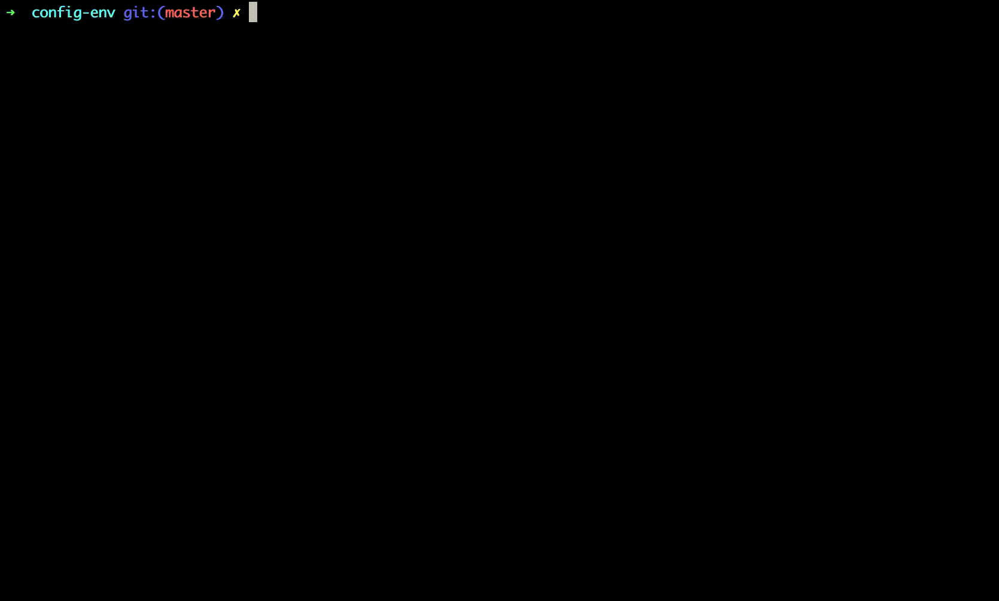

# Installation

By using [npm](http://npmjs.org) or [yarn](https://yarnpkg.com/):

```bash
$ npm install -g env-cli
```
```bash
$ yarn global add env-cli
```

# Usage

env-cli scan the directory where it is execute for all files starting with a dot (.sample.env for instance).

You will be prompted to select which sample file you would use.
The next step is to fill variables with your value and you will be ready to go.

```bash
$ env-cli
```

